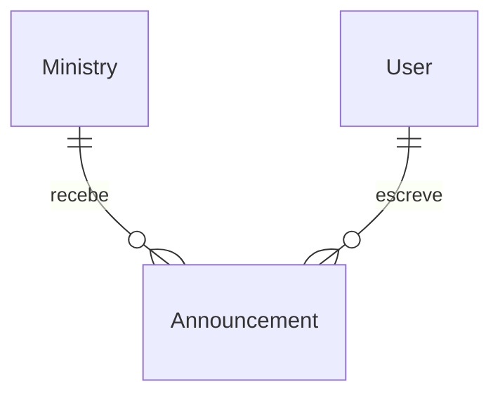

# Avisos do ministério

## Problem

O líder não tem como falar com o ministério pelo app: recado de ensaio, mudança de horário ou
orientação de vestimenta vai para o WhatsApp e se perde no meio de outras conversas. O app já entrega
push para cada pessoa (`notifyUser`), mas só para eventos de escala; não existe um lugar onde o
recado fica guardado para quem abrir depois. A fonte (`docs/discovery/2026-09-21-louveapp.md` §7 e
§9) não traz número; descreve "mural com itens em destaque" e o ganho como "substitui recado perdido
no WhatsApp".

Quando isto sair: o líder publica um aviso para um ministério, todos os membros ativos recebem push,
e o aviso fica em `/avisos`; os marcados como destaque aparecem na página inicial.

## Flow

Reusa `notifyUser` (push idempotente por `dedupeKey`) para avisar os membros e `requireLeaderOf`
como gate de toda escrita.

1. líder abre `/avisos` (new, no door - placement per conventions) -> action -> `announcements` services (door 3)
2. `announcements` services (door 3) - `requireLeaderOf`, valida, grava `Announcement` (door 1)
3. `announcements` services (door 3) pedem os membros ativos a `identity` services (exists) e chamam `notifyUser` (exists) com tipo novo (door 2), uma vez por membro, menos o autor
4. membro abre `/avisos` -> `announcements` services (door 3) listam os avisos dos ministérios dele, destaque primeiro
5. out: página inicial `app/(app)/page.tsx` (exists) mostra os avisos em destaque e a entrada "Avisos"

## Impact

| Front | What changes |
| --- | --- |
| domain | new term: `aviso` - recado de um líder para um ministério, com título, texto e destaque; vive no módulo novo `announcements` |
| domain | existing term: `NotificationType` ganha `ANNOUNCEMENT`; quem ramifica nele hoje: ninguém (só é gravado em `Notification.type`) |
| stored data | uma tabela nova e um valor novo de enum; nada a migrar. Precisa de `prisma migrate deploy` antes do deploy |

## Relations

One-way constraints: apagar o ministério apaga os avisos dele em cascata; apagar o autor apaga os
avisos dele em cascata (door 1).

## Surface

None - nothing consumed outside; páginas e Server Actions só deste repo

## Landing

| One-way door | Literal shape | Alternative rejected |
| --- | --- | --- |
| 1. aviso persistido por ministério | `Announcement(ministryId, authorId, title, body, pinned Boolean @default(false), createdAt)`, `onDelete: Cascade` nas duas relações | aviso global sem ministério: o gate de quem escreve é `requireLeaderOf(ministryId)`; aviso da igreja inteira pede papel que não existe |
| 2. tipo de notificação | valor `ANNOUNCEMENT` no enum `NotificationType` | reusar `ASSIGNMENT`: mistura aviso com escalação no histórico de `Notification` e impede filtrar depois |
| 3. módulo de código novo | `src/modules/announcements/{domain,services}`; membros ativos vêm de serviço de `identity` | pôr em `notifications`: aquele módulo é o transporte (push), não o conteúdo |

- Nothing else in this change is hard to reverse

## Criteria

### S1: Líder publica e gerencia avisos (P1)

**Acceptance Criteria**

1. WHEN o líder cria um aviso com dados válidos THEN o sistema SHALL gravar `Announcement` com ministério, autor, título e texto sem espaços nas pontas, e o destaque informado
2. IF o título é vazio ou passa de 80 caracteres, ou o texto é vazio ou passa de 1000 THEN o sistema SHALL rejeitar com `INVALID_INPUT` sem gravar
3. IF quem chama não lidera o ministério THEN criar, destacar e apagar aviso SHALL falhar com `FORBIDDEN` sem gravar
4. WHEN o aviso é criado THEN o sistema SHALL chamar `notifyUser` uma vez por membro ativo do ministério, exceto o autor, com `type = ANNOUNCEMENT`, `dedupeKey = announcement:<id>:<userId>`, o título do aviso e `url = /avisos`
5. WHEN o líder alterna o destaque THEN o sistema SHALL gravar `pinned` com o valor novo
6. WHEN o líder apaga um aviso THEN o sistema SHALL apagá-lo

**Independent test:** publicar "Ensaio quinta 20h" no Louvor e ver o push chegar para os membros e o aviso em `/avisos`.

### S2: Membro lê os avisos (P1)

**Acceptance Criteria**

7. The system SHALL listar só avisos dos ministérios recebidos, destaque primeiro e depois do mais novo para o mais antigo, no máximo 50, cada um com ministério e nome do autor
8. The system SHALL listar para a página inicial só os avisos em destaque dos ministérios recebidos, do mais novo para o mais antigo, no máximo 3
9. IF não há aviso THEN `/avisos` SHALL mostrar "Nenhum aviso por aqui"
10. The system SHALL mostrar na página inicial a entrada "Avisos" para `/avisos` e, quando houver, o bloco "Avisos em destaque"

**Independent test:** como voluntário, abrir a página inicial, ver o aviso em destaque e abrir `/avisos`.

## Out of scope

| Excluded | Why |
| --- | --- |
| Marcar como lido, contador de não lidos | sem pedido; push já sinaliza a novidade |
| Editar aviso | apagar e publicar de novo cobre; edição silenciosa de recado já lido confunde |
| Aviso para a igreja inteira | pede um papel de escrita global que não existe (door 1) |
| Comentários e chat | fora na triagem do discovery (realtime, WhatsApp já cobre) |
| Expiração automática | o líder apaga; lista limitada a 50 |

## Assumptions

| Assumption | Chosen default | Rationale | Confirmed? |
| --- | --- | --- | --- |
| Quem escreve | líder do ministério e admin | `requireLeaderOf` já trata admin como líder de todos | n |
| Quem lê | membro ativo do ministério; admin lê todos | mesmo alcance de `visibleMinistryIds` | n |
| Autor recebe push do próprio aviso | não | ele acabou de escrever | n |
| Aplicar migração no banco | não aplicada; arquivo commitado (AD-008) | mudança em produção exige autorização explícita | y |
| Plano sem revisão humana | seguir direto para checks e build | usuário pré-aprovou o backlog nesta sessão | y |

**Open questions:**

| # | Kind | Question | Until answered |
| --- | --- | --- | --- |
| 1 | blocks go-live | Quem roda `npm run db:deploy` e quando? | código que lê `Announcement` quebra em produção se subir antes da migração |

## Observable

| Surface | Decision | Landing |
| --- | --- | --- |
| screen `/avisos` | empty state | AC 9 |
| screen `/avisos` | loading, error | existing - `app/(app)/loading.tsx` e `app/(app)/error.tsx` |
| screen `/avisos` | unauthorised | AC 3, AC 7 |
| screen `/avisos` | density and ordering | AC 7 |
| screen `/avisos` | error state do formulário | AC 2 |
| screen `/avisos` | destructive action confirms | existing - `useConfirm` com `tone: "danger"`, mesmo padrão de excluir escala |
| screen página inicial | empty state do bloco de destaque | AC 10 |
| screen página inicial | density and ordering | AC 8 |

## Sources

- `docs/discovery/2026-09-21-louveapp.md` §9 - "Avisos / mural do ministério: push já existe, 1 tabela"
