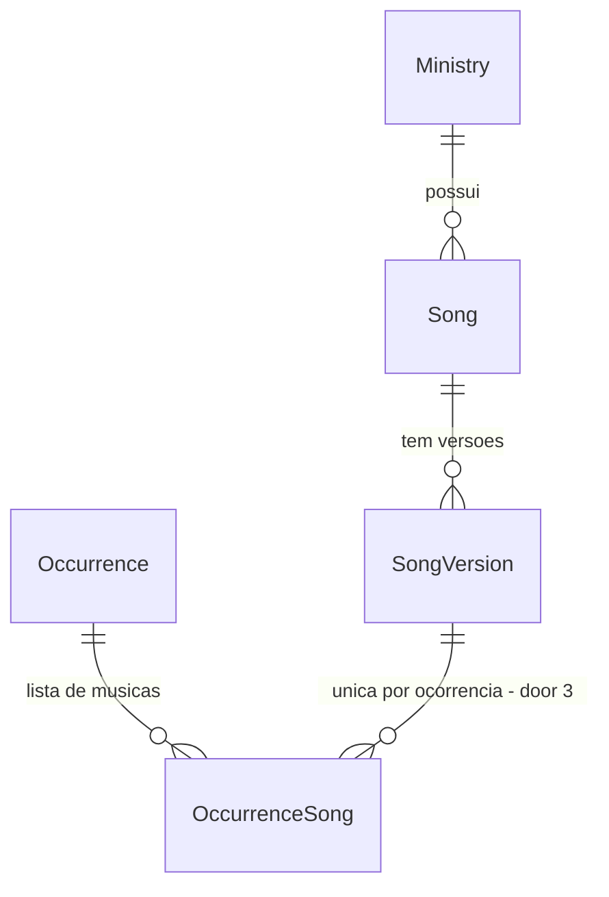

# Repertório e músicas na escala

## Problem

O ministério de louvor não tem onde guardar as músicas que toca: tom, BPM, link da cifra e do áudio
vivem em mensagens de WhatsApp e na memória de quem lidera. O app sabe quem toca em cada data
(`Occurrence` + `Slot` + `Allocation`), mas não sabe o que será tocado, então o músico abre a escala
e ainda precisa perguntar a lista de músicas e o tom. A fonte
(`docs/discovery/2026-09-21-louveapp.md` §2, §3 e §9) não traz número; classifica repertório como
"núcleo do louvor" e músicas na escala como "o que o músico abre no domingo".

Quando isto sair: o líder cadastra músicas com versões (tom, BPM, duração, links), monta a lista de
músicas de cada data, e o músico abre a data e vê as músicas em ordem com tom e links. Ministério
sem música (mídia, recepção) não vê nada disso.

## Flow

Reusa `requireLeaderOf` para toda escrita, `visibleMinistryIds` para saber de quais ministérios o
usuário é membro, e a regra de rascunho de `rascunho-publicar` para a lista de músicas da data.

1. admin liga o módulo -> `EditMinistryForm` (exists) -> `updateMinistry` em `ministries` (exists) grava o flag em `Ministry` (door 1)
2. líder abre `/repertorio` (new, no door - placement per conventions) -> `repertoire` services (door 5) checam módulo ligado via `ministries` services (exists) e gravam `Song` / `SongVersion` (door 2)
3. membro abre `/repertorio` -> `repertoire` services (door 5) listam músicas dos ministérios dele com módulo ligado
4. líder abre a data -> `OccurrenceRow` (exists) link "Músicas" -> `/repertorio/escala/[occurrenceId]` (new, no door - placement per conventions)
5. `repertoire` services (door 5) pedem ministério e estado de publicação da data a `scheduling` services (exists) e gravam `OccurrenceSong` (door 3)
6. out: músico vê a lista em ordem; `getMySchedule` e `listMonthOccurrences` (exists) informam se a data tem link de músicas

## Impact

| Front | What changes |
| --- | --- |
| domain | new term: `repertório` - músicas de um ministério; vive no módulo novo `repertoire` |
| domain | new term: `versão` - um arranjo de uma música (tom, BPM, duração, links); é a versão, não a música, que entra na escala |
| domain | new term: `módulo` - capacidade opcional ligada por ministério; primeiro caso é o repertório |
| code | `MonthOccurrenceItem` e `UpcomingItem` ganham campos; `occurrenceCache.Item` e fixtures de teste acompanham |
| code | `ActionCode` ganha `MODULE_DISABLED`, `INVALID_INPUT`, `ALREADY_IN_SETLIST` |
| stored data | três tabelas novas e uma coluna com default `false`; nada a migrar. Precisa de `prisma migrate deploy` antes do deploy |

## Relations

One-way constraints: uma versão aparece no máximo uma vez por ocorrência (door 3); apagar música
apaga versões e entradas de escala em cascata (door 2).

## Surface

None - nothing consumed outside; páginas e Server Actions só deste repo

## Landing

| One-way door | Literal shape | Alternative rejected |
| --- | --- | --- |
| 1. módulo por ministério | `Ministry.repertoireEnabled Boolean @default(false)` | tabela genérica `MinistryModule(ministryId, key)`: não existe segundo módulo; um booleano migra para tabela sem perda quando existir |
| 2. música e versão separadas | `Song(ministryId, title, artist?, category?, notes?)` 1—N `SongVersion(songId, name, key?, bpm?, durationSec?, notes?, lyricsUrl?, chordsUrl?, audioUrl?, videoUrl?)`, `onDelete: Cascade` | tom/BPM/links direto em `Song`: não guarda a versão acústica em outro tom ao lado da original |
| 3. música na escala por data | `OccurrenceSong(occurrenceId, songVersionId, position)` com `@@unique([occurrenceId, songVersionId])` | lista de músicas em `Schedule` (série): as músicas mudam toda semana, a série não |
| 4. classificação como texto | `Song.category String?`, sugestões vindas dos valores já usados no ministério | tabela `SongCategory` + N:N: exige tela de administração para algo que é rótulo de filtro. Enum do Prisma: não é configurável sem migração |
| 5. módulo de código novo | `src/modules/repertoire/{domain,services}`; lê `Ministry`, `Membership` e `Occurrence` só por serviços de `ministries` e `scheduling` | pôr dentro de `scheduling`: mistura entidades que um ministério sem música nunca usa |
| 6. links como colunas nomeadas | `lyricsUrl`, `chordsUrl`, `audioUrl`, `videoUrl` | tabela `SongLink(label, url)`: referência customizada não foi pedida |

- Nothing else in this change is hard to reverse

## Criteria

### S1: Módulo ligado por ministério (P1)

Repertório só existe onde o admin ligou.

**Acceptance Criteria**

1. The system SHALL manter o repertório desligado em todo ministério existente e em todo ministério novo
2. WHEN o admin salva o ministério com o repertório marcado ou desmarcado THEN `updateMinistry` SHALL gravar `repertoireEnabled` com esse valor
3. WHILE o repertório está desligado no ministério, os serviços de `repertoire` SHALL rejeitar escrita e leitura daquele ministério com `MODULE_DISABLED`

**Independent test:** ligar o módulo no ministério Louvor e ver `/repertorio` passar a aceitar cadastro; desligar e ver "Repertório não está ativo".

### S2: Líder cadastra músicas e versões (P1)

**Acceptance Criteria**

4. WHEN o líder cria uma música com dados válidos THEN o sistema SHALL gravar `Song` no ministério com título sem espaços nas pontas, e artista, classificação e observações vazios como `null`, e uma versão inicial de nome `Original`
5. IF o título é vazio ou passa de 120 caracteres, o artista passa de 120, a classificação de 40 ou as observações de 500 THEN o sistema SHALL rejeitar com `INVALID_INPUT`
6. WHEN o líder cria ou edita uma versão com dados válidos THEN o sistema SHALL gravar nome, tom, BPM, duração em segundos, observações e os quatro links
7. IF o nome da versão é vazio ou passa de 40, o tom passa de 10, o BPM não é inteiro entre 20 e 400, ou a duração não está entre 1 e 7200 segundos THEN o sistema SHALL rejeitar com `INVALID_INPUT`
8. IF um link não começa com `http://` ou `https://` THEN o sistema SHALL rejeitar com `INVALID_INPUT`
9. The system SHALL converter duração digitada `"3:45"` em 225 segundos, `"45"` em 45, vazio em `null`, rejeitar `"3:75"` e `"abc"`, e exibir 225 como `"3:45"`
10. IF quem chama não lidera o ministério da música THEN criar, editar e apagar música ou versão SHALL falhar com `FORBIDDEN` sem gravar
11. WHEN o líder apaga uma música THEN o sistema SHALL apagar a música; versões e entradas de escala saem em cascata

**Independent test:** cadastrar "Bondade de Deus", versão "Original" em Lá, 68 BPM, 5:02, com link de cifra; reabrir e ver os dados.

### S3: Membro consulta o repertório (P1)

**Acceptance Criteria**

12. The system SHALL listar só músicas dos ministérios recebidos que têm o módulo ligado, em ordem de título, cada uma com artista, classificação e número de versões
13. IF quem abre uma música não é membro ativo do ministério dela nem admin THEN o sistema SHALL falhar com `FORBIDDEN`
14. The system SHALL filtrar a lista por texto no título ou artista ignorando maiúsculas e acentos, e por classificação exata
15. IF o usuário não tem ministério com módulo ligado THEN `/repertorio` SHALL mostrar "Repertório não está ativo nos seus ministérios"; IF tem e não há música THEN "Nenhuma música cadastrada"

**Independent test:** como voluntário do Louvor, abrir `/repertorio`, buscar "bondade" e abrir a música.

### S4: Músicas na escala (P1)

**Acceptance Criteria**

16. WHEN o líder adiciona uma versão a uma data THEN o sistema SHALL gravar a entrada com posição igual à maior posição existente + 1 (1 se for a primeira)
17. IF a mesma versão já está naquela data THEN o sistema SHALL falhar com `ALREADY_IN_SETLIST`
18. IF a música da versão pertence a outro ministério que não o da data THEN o sistema SHALL falhar com `INVALID_INPUT`
19. WHEN o líder move uma entrada para cima ou para baixo THEN o sistema SHALL trocar a posição com a vizinha; na borda, SHALL não alterar nada
20. WHEN o líder remove uma entrada THEN o sistema SHALL apagá-la
21. WHEN um membro do ministério abre a lista de uma data THEN o sistema SHALL devolver as entradas em ordem de posição com título, versão, tom, BPM, duração e links
22. IF a data está em rascunho e quem abre não gerencia o ministério THEN a leitura da lista SHALL falhar com `FORBIDDEN`
23. IF quem chama não lidera o ministério da data THEN adicionar, mover e remover SHALL falhar com `FORBIDDEN` sem gravar

**Independent test:** adicionar duas músicas a um domingo, inverter a ordem, abrir como voluntário e ver a ordem nova com tom e link.

### S5: Entradas na interface (P2)

**Acceptance Criteria**

24. WHILE o ministério da data tem o módulo ligado, `listMonthOccurrences` e `getMySchedule` SHALL marcar o item com `repertoireEnabled: true`, e a linha do calendário, o cartão de próxima escala e o cartão de hoje SHALL mostrar o link "Músicas" para `/repertorio/escala/<occurrenceId>`
25. WHILE o usuário tem ao menos um ministério com módulo ligado, a página inicial SHALL mostrar a entrada "Repertório" para `/repertorio`

**Independent test:** com o módulo ligado, ver o link "Músicas" na data; desligar e ver o link sumir.

## Out of scope

| Excluded | Why |
| --- | --- |
| Busca Deezer, autopreenchimento de links | API externa, viola custo zero (triagem do discovery) |
| Importar músicas em lote | só faz sentido em migração; script pontual se surgir |
| Pastas e navegação por artista | filtro por texto e classificação cobre; sem pedido |
| Clonar versão | conveniência; cadastrar outra versão leva segundos |
| Preencher músicas automaticamente, relatório de mais tocadas | itens "com ressalva" e dashboard do backlog |
| Lixeira / soft delete | item 15 do discovery, fora da seleção |
| Líder ligar o módulo sozinho | `updateMinistry` é do admin; um clique, uma vez por ministério |

## Assumptions

| Assumption | Chosen default | Rationale | Confirmed? |
| --- | --- | --- | --- |
| Repertório é de quem | de um ministério | LouveApp organiza por ministério; evita lista global misturando louvor e teatro | n |
| Quantas classificações por música | uma, texto livre com sugestões | rótulo de filtro; door 4 | n |
| Quem liga o módulo | admin, na edição do ministério | reusa `updateMinistry` | n |
| Onde fica a entrada de navegação | linha "Repertório" na página inicial, não na barra inferior | a barra já tem 5 itens para líder | n |
| Módulo desligado depois de ter músicas | dados ficam, telas somem | desligar não apaga | n |
| Aplicar migração no banco | não aplicada; arquivo commitado | mudança em banco de produção exige autorização explícita | y |
| Plano sem revisão humana | seguir direto para checks e build | usuário pré-aprovou o backlog nesta sessão | y |

**Open questions:**

| # | Kind | Question | Until answered |
| --- | --- | --- | --- |
| 1 | blocks go-live | Quem roda `npm run db:deploy` e quando? | código que lê as tabelas novas quebra em produção se subir antes da migração |

## Observable

| Surface | Decision | Landing |
| --- | --- | --- |
| screen `/repertorio` | empty state | AC 15 |
| screen `/repertorio` | loading, error | existing - `app/(app)/loading.tsx` e `app/(app)/error.tsx` |
| screen `/repertorio` | unauthorised | AC 12, AC 15 |
| screen `/repertorio` | density and ordering | AC 12, AC 14 |
| screen `/repertorio/[id]` | unauthorised | AC 13 |
| screen `/repertorio/[id]` | error state do formulário | AC 5, AC 7, AC 8 |
| screen `/repertorio/[id]` | destructive action confirms | existing - `useConfirm` com `tone: "danger"`, mesmo padrão de excluir escala |
| screen `/repertorio/[id]` | empty state | AC 4 - música nasce com a versão `Original`; sem versões, a tela mostra "Nenhuma versão cadastrada" |
| screen `/repertorio/escala/[id]` | empty state | existing - `EmptyState` "Nenhuma música nesta escala" |
| screen `/repertorio/escala/[id]` | unauthorised | AC 22, AC 23 |
| screen `/repertorio/escala/[id]` | ordering | AC 19, AC 21 |
| screen `/repertorio/escala/[id]` | error state | AC 17, AC 18 |
| screen `/repertorio/escala/[id]` | destructive action confirms | n/a - remover da lista é reversível com um toque |

## Sources

- `docs/discovery/2026-09-21-louveapp.md` §9 - repertório (música + versões), músicas na escala, classificações e módulo por ministério entram; Deezer e importação ficam fora
